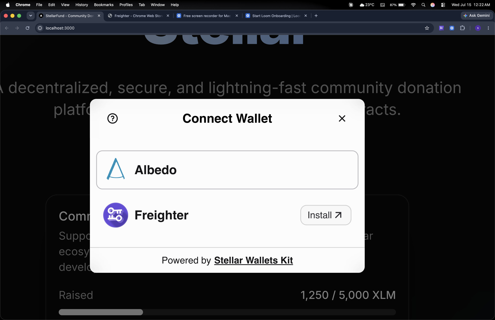
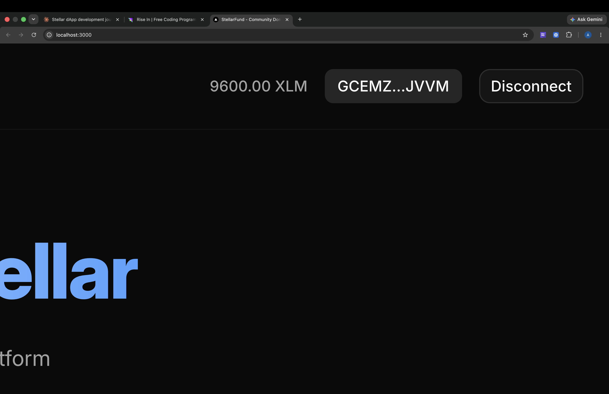
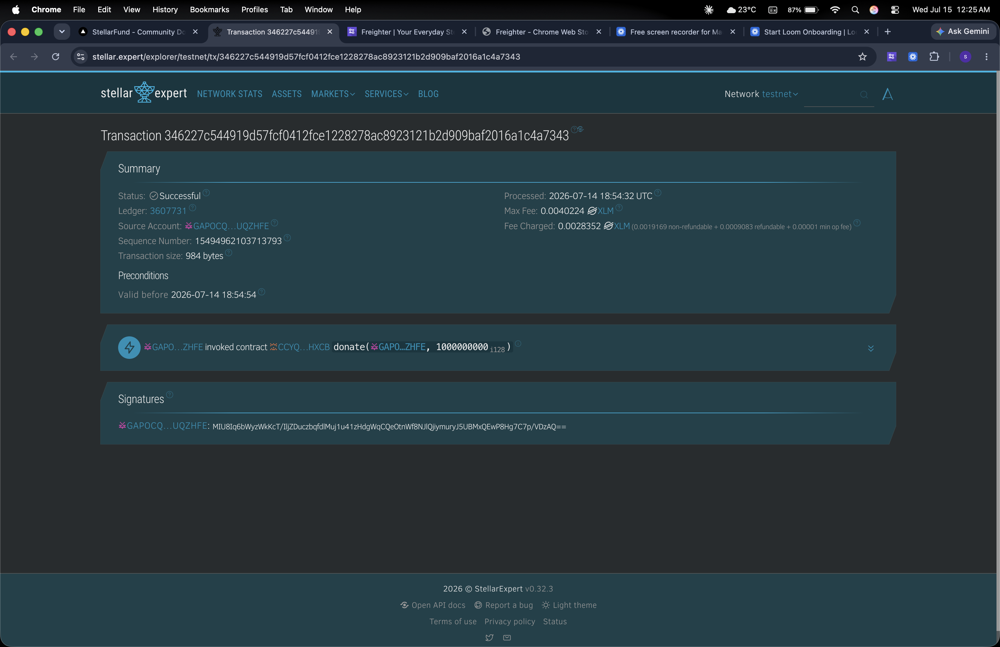
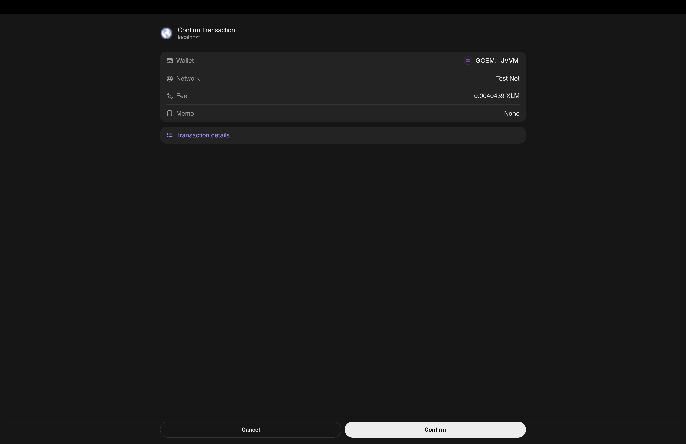
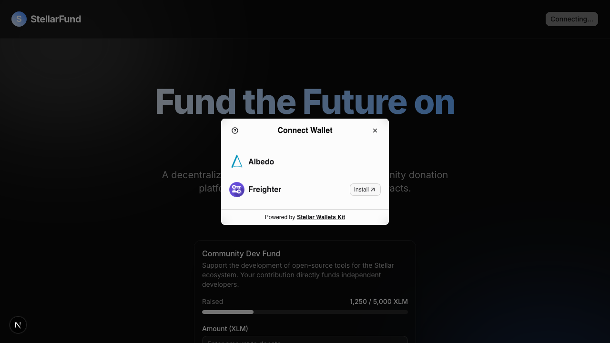

# StellarFund Live

## Description
StellarFund is a decentralized, secure, and transparent community donation and crowdfunding platform built on the Stellar network using Soroban Smart Contracts. Traditional crowdfunding platforms suffer from high fees, slow cross-border transfers, and lack of transparency. StellarFund leverages the Stellar network's low fees and fast settlement times to facilitate instant global donations. 

## Tech Stack
- **Frontend**: Next.js App Router, React, TypeScript, Tailwind CSS, Framer Motion
- **Smart Contracts**: Rust, Soroban SDK
- **Wallet Integration**: `@creit.tech/stellar-wallets-kit`
- **Network**: Stellar Testnet

## Architecture
StellarFund is built with a decoupled architecture separating the on-chain smart contract logic from the frontend user interface.
- Two Soroban SDK contracts written in Rust (`StellarFund` for campaigns, `Badge` for NFT-like cross-contract rewards).
- The Fund contract calls the Badge contract to mint a supporter badge automatically upon donation (Inter-Contract Communication).

## Setup Instructions (Local)

### 1. Smart Contracts
```bash
cd contracts
rustup target add wasm32-unknown-unknown
cargo build --target wasm32-unknown-unknown --release
cargo test
```

### 2. Frontend
```bash
cd frontend
npm install
npm run dev
```

## Deployed Contracts (Testnet)
* **Campaign Contract ID:** `CCYQ3FUACSY4YDCRCC6OK7CKUZ53JE7AQM4N5EYIFVDYCU5KNEJJHXCB`
* **Badge Contract ID:** `CCZUUO5MZEY2O7IUM6GIC5FHH4J7HWQBJSNVJEZIMIOZ7Z6FAIQVGT7B`
* **Badge Trigger Tx Hash:** `696841e6fe697943d8ad40cf8f2ec141f40f3ea220e77e102a691cbfec2fde5a`

## Live Demo
[StellarFund on Vercel](https://stellar-levels.vercel.app/)

## Demo Video
[Watch Demo on Loom](https://www.loom.com/share/8a7741daac7b4931b7bd3ca7b2bf7c9b)

## Screenshots

### Level 1
  - Wallet connected:
    
  - Balance displayed:
    
  - Successful transaction:
    
  - Transaction result shown:
    

### Level 2
  - Wallet options modal:
    
  - 3 Distinct Error States [SCREENSHOT: user-provided]

### Level 3
  - Mobile responsive [SCREENSHOT: user-provided]
  - CI/CD passing [SCREENSHOT: user-provided]
  - Test output [SCREENSHOT: user-provided]

## Testing
- **Smart Contracts**: Run `cargo test` in the `contracts/` directory to verify cross-contract calls and fund logic.
- **Frontend**: Run `npm run test` in the `frontend/` directory to run Jest and React Testing Library tests on components and hooks.

## Error Handling Summary
| Action | Error Scenario | UI Response |
| :--- | :--- | :--- |
| **Donation** | Insufficient Balance | Toast notification indicating insufficient funds |
| **Donation** | Invalid Contract ID | Toast notification indicating transaction simulation failed |
| **Donation** | User Rejects Signature | Toast notification indicating user rejected signature |

## Commit History
- `level1-submission`
- `level2-submission`
- `level3-submission`
