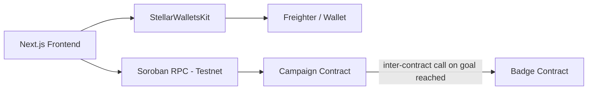

<div align="center">
  <h1>🌟 StellarFund Live</h1>
  <p><strong>A decentralized, secure, and lightning-fast community donation platform powered by Soroban Smart Contracts.</strong></p>
</div>

---

## 📖 Description
StellarFund is a next-generation crowdfunding platform built on the Stellar network. Traditional platforms suffer from high fees, slow cross-border transfers, and a lack of transparency. StellarFund leverages the Stellar network's low fees and fast settlement times to facilitate instant, verifiable global donations.

## 🛠 Tech Stack


- **Frontend**: Next.js App Router, React, TypeScript, Tailwind CSS, Framer Motion
- **Smart Contracts**: Rust, Soroban SDK
- **Wallet Integration**: `@creit.tech/stellar-wallets-kit`
- **Network**: Stellar Testnet

## 🏗 Architecture
StellarFund is built with a decoupled architecture separating the on-chain smart contract logic from the frontend user interface.
- **Two Soroban SDK contracts** written in Rust (`StellarFund` for campaigns, `Badge` for NFT-like cross-contract rewards).
- The Fund contract automatically calls the Badge contract to mint a supporter badge upon donation (**Inter-Contract Communication**).



---

## 🚀 Setup Instructions (Local)

### 1. Smart Contracts
```bash
cd contracts
rustup target add wasm32-unknown-unknown
cargo build --target wasm32-unknown-unknown --release
cargo test
```

### 2. Frontend
```bash
cd frontend
npm install
npm run dev
```

---

## 🔗 Live Links & Deployments

| Resource | Link / Hash / Address |
|---|---|
| **Live Demo** | 🌐 [StellarFund on Vercel](https://stellar-levels.vercel.app/) |
| **Demo Video** | 🎥 [Watch Demo on Loom](https://www.loom.com/share/8a7741daac7b4931b7bd3ca7b2bf7c9b) |
| **Campaign Contract** | [`CCYQ3FUACSY4YDCRCC6OK7CKUZ53JE7AQM4N5EYIFVDYCU5KNEJJHXCB`](https://stellar.expert/explorer/testnet/contract/CCYQ3FUACSY4YDCRCC6OK7CKUZ53JE7AQM4N5EYIFVDYCU5KNEJJHXCB) |
| **Badge Contract** | [`CCZUUO5MZEY2O7IUM6GIC5FHH4J7HWQBJSNVJEZIMIOZ7Z6FAIQVGT7B`](https://stellar.expert/explorer/testnet/contract/CCZUUO5MZEY2O7IUM6GIC5FHH4J7HWQBJSNVJEZIMIOZ7Z6FAIQVGT7B) |
| **Badge Trigger Tx** | [`696841e6fe697943d8ad40cf8f2ec141f40f3ea220e77e102a691cbfec2fde5a`](https://stellar.expert/explorer/testnet/tx/696841e6fe697943d8ad40cf8f2ec141f40f3ea220e77e102a691cbfec2fde5a) |

---

## 📸 Screenshots & Evidence

### Level 1
- **Wallet connected**:
  
- **Balance displayed**:
  
- **Successful transaction**:
  
- **Transaction result shown**:
  

### Level 2
- **Wallet options modal**:
  
- **3 Distinct Error States**: [SCREENSHOT: user-provided]

### Level 3
- **Mobile responsive UI**: [SCREENSHOT: user-provided]
- **CI/CD passing**: [SCREENSHOT: user-provided]
- **Test output**: [SCREENSHOT: user-provided]

---

## 🧪 Testing
- **Smart Contracts**: Run `cargo test` in the `contracts/` directory to verify cross-contract calls and fund logic.
- **Frontend**: Run `npm run test` in the `frontend/` directory to execute Jest and React Testing Library tests on components and hooks.

## 🛡 Error Handling Summary
| Action | Error Scenario | UI Response |
| :--- | :--- | :--- |
| **Donation** | Insufficient Balance | Toast notification indicating insufficient funds |
| **Donation** | Invalid Contract ID | Toast notification indicating transaction simulation failed |
| **Donation** | User Rejects Signature | Toast notification indicating user rejected signature |

---

## 📝 Commit Tags
- `level1-submission`
- `level2-submission`
- `level3-submission`
