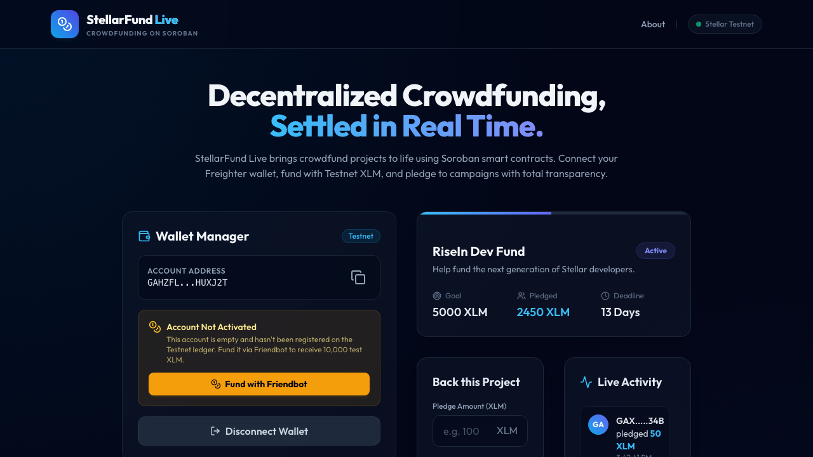
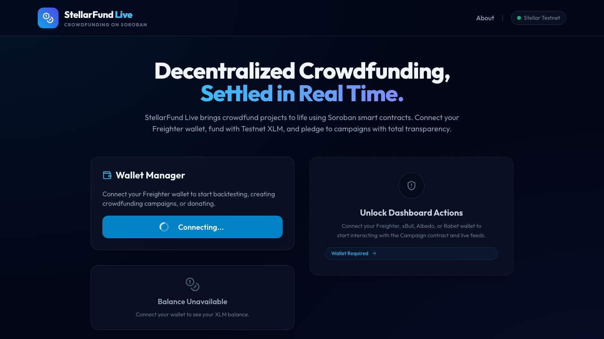

<div align="center">
  
  <h1>🚀 StellarFund Live</h1>
  <p><b>A real-time, decentralized crowdfunding dApp on the Stellar Soroban Testnet</b></p>
  
  [](https://opensource.org/licenses/MIT)
  [](https://stellar.expert/)
  [](https://soroban.stellar.org/)
  [](https://github.com/Ayan1911/stellar-levels/actions)
</div>

<br />

> Built for the **RiseIn Stellar Journey to Mastery** across White Belt (wallet + payments), Yellow Belt (multi-wallet + contract), and Orange Belt (inter-contract calls, tests, CI/CD).

---

## 📖 Description
StellarFund Live is a fully transparent and non-custodial crowdfunding platform. It empowers project creators to raise XLM with absolute security, leveraging **Soroban smart contracts** to lock funds safely on-chain until the funding goals are met. Backers can pledge with confidence, knowing their contributions are managed trustlessly.

---

## ⚡ Tech Stack & Architecture

### **Architecture Flow**
`Frontend UI` ⇄ `StellarWalletsKit` ⇄ `Soroban RPC (Testnet)` ⇄ `Campaign Contract` ⇄ `Badge Contract (Goal Reached)`

### **Technologies Used**
* **Frontend:** React, TypeScript, Vite, Tailwind CSS
* **Wallet Integration:** StellarWalletsKit (Freighter, xBull, Albedo, Rabet)
* **Blockchain/Backend:** @stellar/stellar-sdk, Soroban Smart Contracts (Rust)
* **Testing & CI/CD:** Vitest, React Testing Library, GitHub Actions

---

## 🔗 Live Links & Contracts

| Resource | Link / Hash / Address |
|---|---|
| **Live Demo** | 🌐 [StellarFund on Vercel](https://stellar-levels.vercel.app/) |
| **Demo Video** | 🎥 **[⚠️ INSERT YOUR YOUTUBE/LOOM LINK HERE ⚠️]** |
| **Campaign Contract** | [`CDDYMQBKHR4TZ5LO3HCLFF56MFPAVLUECZ4665DAU2US7UMZZY4KDVNQ`](https://stellar.expert/explorer/testnet/contract/CDDYMQBKHR4TZ5LO3HCLFF56MFPAVLUECZ4665DAU2US7UMZZY4KDVNQ) |
| **Badge Contract** | [`CDUOSMYK4P7D3QUVH6HYXF5MRCICCC4UVXPJAWDRLYELF33ZXMJZYZ5R`](https://stellar.expert/explorer/testnet/contract/CDUOSMYK4P7D3QUVH6HYXF5MRCICCC4UVXPJAWDRLYELF33ZXMJZYZ5R) |
| **Contract Tx Hash** | [`c02144f450a87a04747edbac6d2982fb68fb8913aca4460ad6c9a716e838ffe8`](https://stellar.expert/explorer/testnet/tx/c02144f450a87a04747edbac6d2982fb68fb8913aca4460ad6c9a716e838ffe8) |
| **Public GitHub Repo** | [Ayan1911/stellar-levels](https://github.com/Ayan1911/stellar-levels) |

---

## 📸 Project Screenshots

### Level 1 — White Belt: Wallet & Payments
| Wallet Connected State | Balance Displayed |
|:---:|:---:|
|  |  |
| **Successful Testnet Tx** | **Tx Result Shown** |
|  |  |

### Level 2 — Yellow Belt: Multi-Wallet & Contract
| Wallet Options (Modal) | Error: Wallet Not Found |
|:---:|:---:|
|  |  |
| **Error: Rejected Signature** | **Error: Insufficient Balance** |
|  |  |

### Level 3 — Orange Belt: Production, Tests, CI/CD
| Mobile Responsive UI | CI/CD Pipeline Running |
|:---:|:---:|
|  |  |
| **Test Output (3+ Passing)** | **Goal Reached (Badge Awarded)** |
|  |  |

---

## 🛠 Setup Instructions (Local)

1. **Prerequisites**: Node 18+, Rust + Cargo, Stellar CLI, and a Stellar wallet browser extension (Freighter recommended).
2. **Clone the Repository**: 
   ```bash
   git clone https://github.com/Ayan1911/stellar-levels.git
   cd stellar-levels
   ```
3. **Compile Contracts**: 
   ```bash
   cd contracts && cargo test
   ../scripts/deploy_contracts.sh # (Optional) Redeploy locally
   ```
4. **Run Frontend**: 
   ```bash
   cd frontend
   npm install
   cp .env.example .env.local 
   # Set VITE_CAMPAIGN_CONTRACT_ID and VITE_BADGE_CONTRACT_ID
   npm run dev
   ```
5. **Fund a Wallet**: Use the in-app "Fund with Friendbot" button or visit [friendbot.stellar.org](https://friendbot.stellar.org/).

---

## 🧪 Testing

```bash
# Smart Contracts (Rust)
cargo test --manifest-path contracts/Cargo.toml

# Frontend (Vitest)
cd frontend && npm test
```

---

## 🚨 Error Handling Summary

| Error Type | Where Caught | User-Facing Message |
|---|---|---|
| **Invalid Destination** | `SendPayment.tsx` | "Please enter a valid Stellar address" |
| **Insufficient Balance** | `contract.ts` / `SendPayment` | "Insufficient XLM balance for this transaction" |
| **User Rejected Tx** | `useWallet.tsx` | "Transaction was cancelled" |
| **Wallet Not Found** | `walletKit.ts` | "No compatible wallet detected — install Freighter" |
| **Missed Deadline** | `Campaign Contract` | "This campaign has ended and can no longer accept pledges" |

---

## 📌 Commit History (10+ Meaningful Commits)
- ⚪ **Level 1**: `level1-submission` tag — Wallet connect/disconnect, balance display, XLM payment flow.
- 🟡 **Level 2**: `level2-submission` tag — StellarWalletsKit multi-wallet, Campaign contract deployment, live event feed.
- 🟠 **Level 3**: `level3-submission` tag — Badge contract inter-contract calls, automated tests, CI/CD pipeline, mobile responsiveness, and production hardening.

---
*License: MIT*
