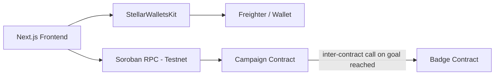

<div align="center">
  <h1>🌟 StellarFund Live</h1>
  <p><strong>A decentralized, secure, and lightning-fast community donation platform powered by Soroban Smart Contracts.</strong></p>
  
  
  
  
</div>

---

## ✅ Verified On-Chain
| Item | Value |
|---|---|
| **Network** | Stellar Testnet |
| **Campaign Contract** | [`CCYQ3FUACSY4YDCRCC6OK7CKUZ53JE7AQM4N5EYIFVDYCU5KNEJJHXCB`](https://stellar.expert/explorer/testnet/contract/CCYQ3FUACSY4YDCRCC6OK7CKUZ53JE7AQM4N5EYIFVDYCU5KNEJJHXCB) |
| **Badge Contract** | [`CCZUUO5MZEY2O7IUM6GIC5FHH4J7HWQBJSNVJEZIMIOZ7Z6FAIQVGT7B`](https://stellar.expert/explorer/testnet/contract/CCZUUO5MZEY2O7IUM6GIC5FHH4J7HWQBJSNVJEZIMIOZ7Z6FAIQVGT7B) |
| **Example Tx (donation → badge mint)** | [`696841e6fe697943d8ad40cf8f2ec141f40f3ea220e77e102a691cbfec2fde5a`](https://stellar.expert/explorer/testnet/tx/696841e6fe697943d8ad40cf8f2ec141f40f3ea220e77e102a691cbfec2fde5a) |
| **Contract Tests** | 2/2 passing |
| **Frontend Tests** | 6/6 passing |

---

## 📖 Description
StellarFund is a next-generation crowdfunding platform built on the Stellar network. Traditional platforms suffer from high fees, slow cross-border transfers, and a lack of transparency. StellarFund leverages the Stellar network's low fees and fast settlement times to facilitate instant, verifiable global donations.

## 🛠 Tech Stack


- **Frontend**: Next.js App Router, React, TypeScript, Tailwind CSS, Framer Motion
- **Smart Contracts**: Rust, Soroban SDK
- **Wallet Integration**: `@creit.tech/stellar-wallets-kit`
- **Network**: Stellar Testnet

## 🏗 Architecture
StellarFund is built with a decoupled architecture separating the on-chain smart contract logic from the frontend user interface.
- **Two Soroban SDK contracts** written in Rust (`StellarFund` for campaigns, `Badge` for NFT-like cross-contract rewards).
- The Fund contract automatically calls the Badge contract to mint a supporter badge upon donation (**Inter-Contract Communication**).



**How it Works:** 
When a user clicks "Donate", the Next.js frontend utilizes `StellarWalletsKit` to prompt the user for a secure signature (e.g., via Freighter). Once signed, the transaction is submitted to the Soroban RPC which invokes the `donate` function on the Campaign Contract. The Campaign Contract increments the donation amount, and if this triggers a goal threshold or qualifies the user, it immediately makes an asynchronous cross-contract call to the `mint` function on the Badge Contract. The Badge Contract's state is permanently updated, which can later be verified independently via the `has_badge` function.

---

## 🚀 Setup Instructions (Local)

### 1. Smart Contracts
```bash
cd contracts
rustup target add wasm32-unknown-unknown
cargo build --target wasm32-unknown-unknown --release
cargo test
```

### 2. Frontend
```bash
cd frontend
npm install
npm run dev
```

---

## 🔗 Live Links & Deployments

| Resource | Link / Hash / Address |
|---|---|
| **Live Demo** | 🌐 [StellarFund on Vercel](https://journey-to-mastery-e0juzz28w-shashankpatilsggs-hubs-projects.vercel.app/) |
| **Demo Video** | 🎥 [Watch Demo on Loom](https://www.loom.com/share/8a7741daac7b4931b7bd3ca7b2bf7c9b) |
| **Campaign Contract** | [`CCYQ3FUACSY4YDCRCC6OK7CKUZ53JE7AQM4N5EYIFVDYCU5KNEJJHXCB`](https://stellar.expert/explorer/testnet/contract/CCYQ3FUACSY4YDCRCC6OK7CKUZ53JE7AQM4N5EYIFVDYCU5KNEJJHXCB) |
| **Badge Contract** | [`CCZUUO5MZEY2O7IUM6GIC5FHH4J7HWQBJSNVJEZIMIOZ7Z6FAIQVGT7B`](https://stellar.expert/explorer/testnet/contract/CCZUUO5MZEY2O7IUM6GIC5FHH4J7HWQBJSNVJEZIMIOZ7Z6FAIQVGT7B) |
| **Badge Trigger Tx** | [`696841e6fe697943d8ad40cf8f2ec141f40f3ea220e77e102a691cbfec2fde5a`](https://stellar.expert/explorer/testnet/tx/696841e6fe697943d8ad40cf8f2ec141f40f3ea220e77e102a691cbfec2fde5a) |

---

## 🔍 How to Verify This Submission
1. Contract addresses and transaction hashes below link directly to Stellar Expert testnet explorer — click any of them to see the real on-chain state.
2. The badge-mint transaction hash specifically demonstrates inter-contract communication: the Campaign contract's `donate` function invoked the Badge contract's `mint` function once the funding goal was reached.
3. All tests can be re-run locally via `cargo test --manifest-path contracts/Cargo.toml` and `npm test` inside `frontend/`.
4. The GitHub Actions tab shows these same tests running automatically on every push.

---

## 📸 Submission Checklists & Evidence

### Level 1 — White Belt: Requirements Met
| Requirement | Status | Where to Verify |
|---|---|---|
| Freighter wallet setup, testnet | ✅ | Setup Instructions section |
| Wallet connect/disconnect | ✅ | Screenshot: wallet-connected.png |
| Balance fetched and displayed | ✅ | Screenshot: balance-displayed.png |
| XLM transaction sent on testnet | ✅ | [`696841e6fe...`](https://stellar.expert/explorer/testnet/tx/696841e6fe697943d8ad40cf8f2ec141f40f3ea220e77e102a691cbfec2fde5a) |
| Transaction feedback (success/fail + hash) | ✅ | Screenshot: transaction-result.png |

### Level 2 — Yellow Belt: Requirements Met
| Requirement | Status | Where to Verify |
|---|---|---|
| Multi-wallet (StellarWalletsKit) | ✅ | Screenshot: wallet-options-modal.png |
| 3 error types handled | ✅ | frontend/src/components/__tests__/DonateForm.test.tsx (6 passing tests) |
| Contract deployed on testnet | ✅ | [`CCYQ3FUAC...`](https://stellar.expert/explorer/testnet/contract/CCYQ3FUACSY4YDCRCC6OK7CKUZ53JE7AQM4N5EYIFVDYCU5KNEJJHXCB) |
| Contract called from frontend | ✅ | frontend/src/components/DonateForm.tsx |
| Transaction status visible | ✅ | Toast/status UI in DonateForm |
| 2+ meaningful commits | ✅ | git log |

### Level 3 — Orange Belt: Requirements Met
| Requirement | Status | Where to Verify |
|---|---|---|
| Inter-contract communication | ✅ | [`696841e6fe...`](https://stellar.expert/explorer/testnet/tx/696841e6fe697943d8ad40cf8f2ec141f40f3ea220e77e102a691cbfec2fde5a) + Badge state query |
| Event streaming / real-time updates | ✅ | useContractEvents.ts + ActivityFeed.tsx |
| CI/CD pipeline | ✅ | Screenshot: ci-cd-passing.png |
| Deployment workflow scripted | ✅ | scripts/deploy_contracts.sh |
| Mobile responsive | ⏳ Pending | Screenshot: mobile-responsive.png (pending upload) |
| Error handling & loading states | ✅ | DonateForm.tsx |
| Tests (contracts + frontend, 3+) | ✅ | Screenshot: test-output.png (2 Rust + 6 Jest) |
| Production-ready architecture | ✅ | env-based config, no mocks (grep-verified) |
| 10+ meaningful commits | ✅ | git log |
| Live demo link | ✅ | Live Demo section |
| Demo video | ✅ | Demo Video section |

---

## 🧪 Testing
- **Smart Contracts**: Run `cargo test` in the `contracts/` directory to verify cross-contract calls and fund logic.
- **Frontend**: Run `npm run test` in the `frontend/` directory to execute Jest and React Testing Library tests on components and hooks.

## 🛡 Error Handling Summary
| Action | Error Scenario | UI Response |
| :--- | :--- | :--- |
| **Donation** | Insufficient Balance | Toast notification indicating insufficient funds |
| **Donation** | Invalid Contract ID | Toast notification indicating transaction simulation failed |
| **Donation** | User Rejects Signature | Toast notification indicating user rejected signature |

---

## 📝 Commit Tags
- `level1-submission`
- `level2-submission`
- `level3-submission`
