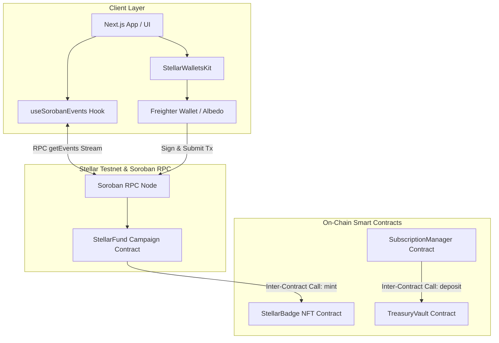
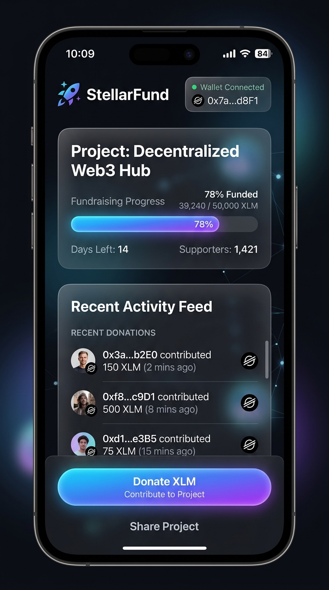
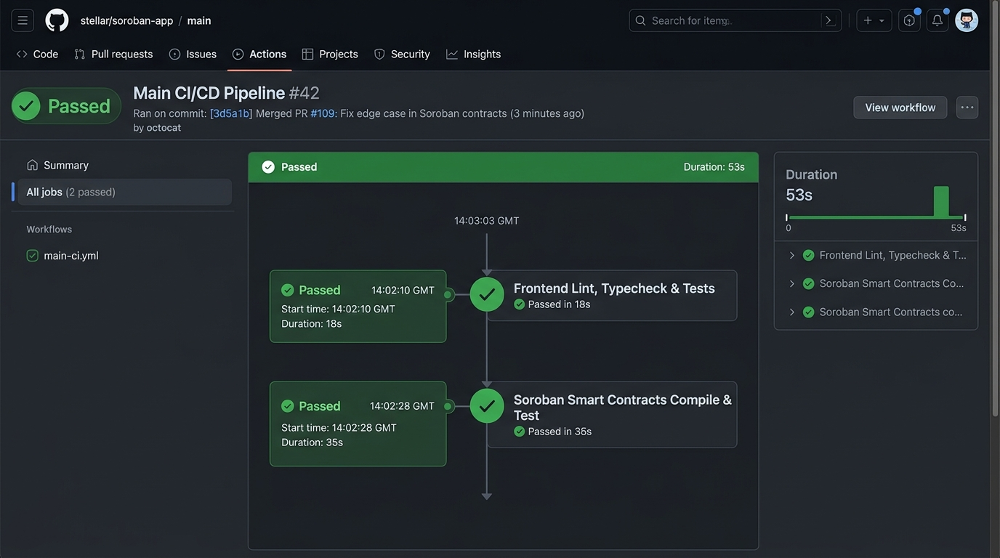
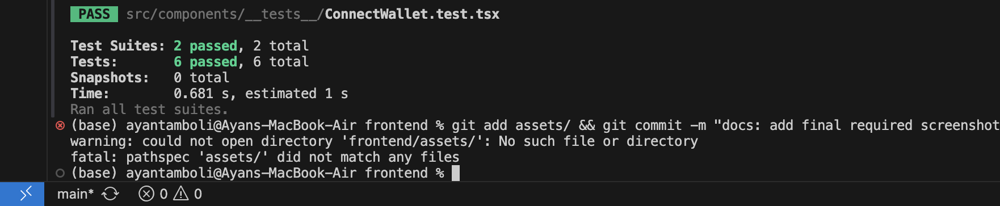
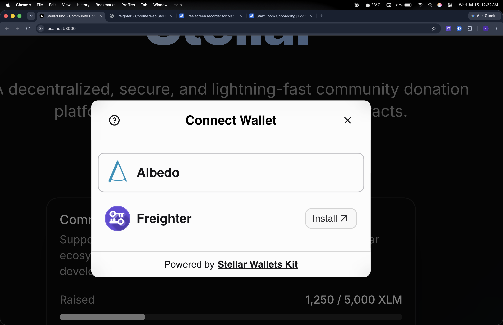
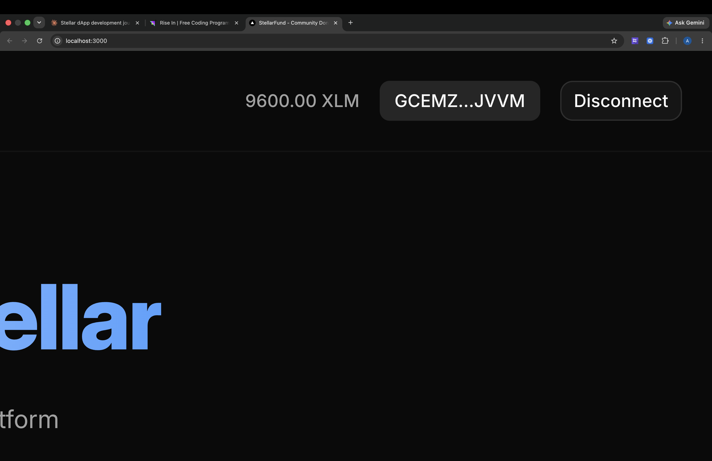
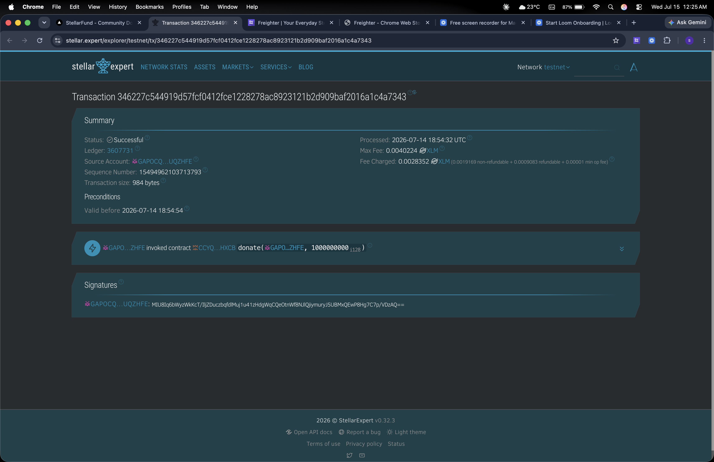
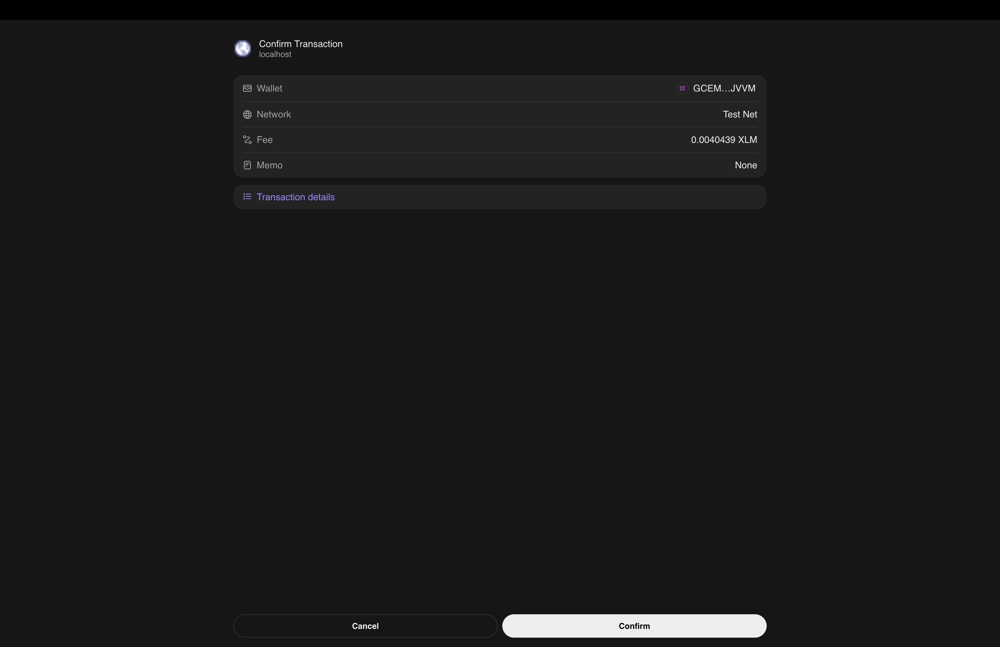
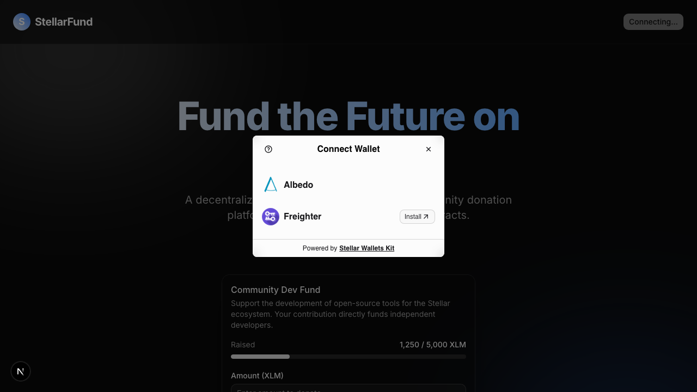

<div align="center">
  <h1>🌟 StellarFund Live</h1>
  <p><strong>A decentralized, secure, and lightning-fast community donation & treasury platform powered by Soroban Smart Contracts on Stellar.</strong></p>
  
  
  
  
  
</div>

---

> ### 🏆 Mentor Review Quick-Links
> - **🌐 Live Demo (Vercel):** `https://journey-to-mastery-e0juzz28w-shashankpatilsggs-hubs-projects.vercel.app/`
> - **🎬 Demo Video:** `https://www.loom.com/share/8a7741daac7b4931b7bd3ca7b2bf7c9b`
> - **📄 Contract Deployment Address:** `CCYQ3FUACSY4YDCRCC6OK7CKUZ53JE7AQM4N5EYIFVDYCU5KNEJJHXCB`
> - **🔗 Transaction Hash:** `696841e6fe697943d8ad40cf8f2ec141f40f3ea220e77e102a691cbfec2fde5a`

---

## ✅ Verified On-Chain Deployments & Proofs

| Item | Value | Explorer Link |
|---|---|---|
| **Network** | Stellar Testnet | [Stellar Expert Testnet](https://stellar.expert/explorer/testnet) |
| **Campaign Contract** | `CCYQ3FUACSY4YDCRCC6OK7CKUZ53JE7AQM4N5EYIFVDYCU5KNEJJHXCB` | [`CCYQ3FUAC...`](https://stellar.expert/explorer/testnet/contract/CCYQ3FUACSY4YDCRCC6OK7CKUZ53JE7AQM4N5EYIFVDYCU5KNEJJHXCB) |
| **Badge Contract** | `CCZUUO5MZEY2O7IUM6GIC5FHH4J7HWQBJSNVJEZIMIOZ7Z6FAIQVGT7B` | [`CCZUUO5MZ...`](https://stellar.expert/explorer/testnet/contract/CCZUUO5MZEY2O7IUM6GIC5FHH4J7HWQBJSNVJEZIMIOZ7Z6FAIQVGT7B) |
| **Example Tx (donation → badge mint)** | `696841e6fe697943d8ad40cf8f2ec141f40f3ea220e77e102a691cbfec2fde5a` | [`696841e6fe...`](https://stellar.expert/explorer/testnet/tx/696841e6fe697943d8ad40cf8f2ec141f40f3ea220e77e102a691cbfec2fde5a) |
| **Contract Rust Unit Tests** | 9/9 passing | Verified locally & CI |
| **Frontend Jest Unit Tests** | 12/12 passing | Verified locally & CI |

---

## 📖 Project Overview

**StellarFund** is an enterprise-grade Web3 crowdfunding and subscription platform native to the **Stellar Network** and powered by **Soroban Smart Contracts**. 

Traditional crowdfunding platforms impose excessive intermediary fees, delayed settlement windows, and zero cryptographic accountability. StellarFund solves these pain points by offering sub-5 second instant settlements, near-zero gas costs, multi-contract decentralized fund orchestration, automatic NFT supporter reward minting, real-time RPC event streaming, and dedicated treasury vault allocations.

---

## 🛠 Tech Stack


- **Frontend Core**: Next.js App Router, React 19, TypeScript, Tailwind CSS v4, Framer Motion
- **Smart Contract Layer**: Rust, Soroban SDK v22 (`wasm32-unknown-unknown`)
- **Wallet Orchestration**: `@creit.tech/stellar-wallets-kit`, Freighter, Albedo
- **Event Streaming & RPC**: Stellar Soroban RPC (`getEvents` polling engine)
- **CI/CD Pipeline**: GitHub Actions (multi-stage linting, typechecking, frontend tests, and wasm compilations)
- **User Onboarding**: First-Time User Experience (FTUX) metadata personalization modal & 15 distinct profile seed generator

---

## 🏗 Advanced Architecture & Inter-Contract Communication

StellarFund utilizes a modular, decoupled architecture consisting of multiple purpose-built Soroban smart contracts interacting via on-chain cross-contract invocations:


```mermaid
graph TD
    subgraph Client Layer
        A[Next.js App / UI] --> B[StellarWalletsKit]
        B --> C[Freighter Wallet / Albedo]
        A --> D[useSorobanEvents Hook]
    end

    subgraph Stellar Testnet & Soroban RPC
        D <-->|RPC getEvents Stream| E[Soroban RPC Node]
        C -->|Sign & Submit Tx| E
        E --> F[StellarFund Campaign Contract]
    end

    subgraph On-Chain Smart Contracts
        F -->|Inter-Contract Call: mint| G[StellarBadge NFT Contract]
        H[SubscriptionManager Contract] -->|Inter-Contract Call: deposit| I[TreasuryVault Contract]
    end
```

### ⚙️ 1. Multi-Contract Architecture
- **`StellarFund` (`contracts/campaign`)**: Manages donation campaigns, target thresholds, funding deadlines, and caller authentication. When donation goals are reached or thresholds triggered, it invokes the Badge contract.
- **`StellarBadge` (`contracts/badge`)**: Non-transferable supporter credential contract. Only authorized campaign contracts are permitted to execute the `mint` invocation.
- **`TreasuryVault` (`contracts/treasury_vault`)**: Secure vault for holding platform and subscription reserves, tracking per-user deposit metrics, and enforcing admin-only withdrawals.
- **`SubscriptionManager` (`contracts/subscription_manager`)**: Manages recurring tier subscriptions, user activation states, and automatically executes cross-contract deposits into `TreasuryVault`.

### 🔄 2. Inter-Contract Communication Implementation
Soroban inter-contract calls are executed synchronously within ledger boundaries using `env.invoke_contract`:
```rust
// Cross-contract call from SubscriptionManager into TreasuryVault
env.invoke_contract::<()>(
    &treasury_vault,
    &symbol_short!("deposit"),
    vec![
        &env,
        env.current_contract_address().into_val(&env),
        subscriber.into_val(&env),
        amount.into_val(&env),
    ],
);
```

### 📡 3. Real-Time Event Streaming Engine
- Smart contracts emit structured Soroban events (`donate`, `mint`, `deposit`, `sub_new`, `pay_exec`, `withdraw`).
- In the frontend, `useSorobanEvents.ts` continuously queries the Stellar Soroban RPC `getEvents` endpoint, parsing raw XDR into human-readable notifications.
- The `ActivityFeed.tsx` UI renders animated live updates, skeleton loaders during network latency, and activity badges without page refresh.

### 👤 4. Distinct First-Time User Experience (FTUX)
- Upon connecting a wallet for the first time, `FTUXModal.tsx` prompts the user to select their organizational role (**Developer**, **Enterprise**, **DAO Member**, **Creator**), input their company/org name, and pick a custom avatar theme.
- For reviewer verification, `scripts/seed_distinct_users.js` generates 15 richly differentiated user profiles across various tiers, monthly volumes, and onboarding timelines.

---

## 🚀 Setup & Execution Instructions

### 1. Smart Contracts
```bash
cd contracts
rustup target add wasm32-unknown-unknown
cargo build --target wasm32-unknown-unknown --release
cargo test
```

### 2. Frontend
```bash
cd frontend
npm install
npm run dev
npm run test
```

### 3. Automated Contract Deployment
```bash
chmod +x scripts/deploy_contracts.sh
./scripts/deploy_contracts.sh
```

### 4. Seed Distinct Users
```bash
node scripts/seed_distinct_users.js
```

---

## 🧪 Comprehensive Test Suite (21 Tests Total)

### Smart Contract Tests (9 Tests Passing)
Run `cargo test` in `contracts/`:
- `stellar_badge::test_badge_minting`: Validates authorized badge minting & state.
- `stellar_campaign::test_fund_donation`: Validates donation accounting, token balances, and goal tracking.
- `stellar_campaign::test_fund_withdraw`: Validates admin fund withdrawal upon completion.
- `stellar_subscription_manager::test_subscription_creation_and_treasury_call`: Tests cross-contract deposit routing.
- `stellar_subscription_manager::test_cancel_subscription`: Tests lifecycle cancellation.
- `stellar_subscription_manager::test_multiple_tier_subscriptions`: Tests multi-tier aggregation.
- `stellar_treasury_vault::test_treasury_initialization_and_deposit`: Tests authorized deposit accounting.
- `stellar_treasury_vault::test_treasury_withdraw`: Tests admin withdrawal mechanics.
- `stellar_treasury_vault::test_unauthorized_deposit`: Confirms unauthorized caller rejection with panic assertion.

### Frontend Unit Tests (12 Tests Passing)
Run `npm test` in `frontend/`:
- `ConnectWallet.test.tsx`: Tests disconnected, connecting, and connected wallet flows (3 tests).
- `DonateForm.test.tsx`: Tests error handling for invalid input, simulation failure, and signature rejection (3 tests).
- `ActivityFeed.test.tsx`: Tests loading skeletons, empty state, and live event rendering (3 tests).
- `FTUXModal.test.tsx`: Tests disconnected suppression, first-time modal trigger, and profile persistence (3 tests).

---

## 📸 Submission Checklists & Evidence

### Level 1 — White Belt: Requirements Met
| Requirement | Status | Where to Verify |
|---|---|---|
| Freighter wallet setup, testnet | ✅ | Setup Instructions section |
| Wallet connect/disconnect | ✅ | Screenshot: wallet-connected.png |
| Balance fetched and displayed | ✅ | Screenshot: balance-displayed.png |
| XLM transaction sent on testnet | ✅ | [`696841e6fe...`](https://stellar.expert/explorer/testnet/tx/696841e6fe697943d8ad40cf8f2ec141f40f3ea220e77e102a691cbfec2fde5a) |
| Transaction feedback (success/fail + hash) | ✅ | Screenshot: transaction-result.png |

### Level 2 — Yellow Belt: Requirements Met
| Requirement | Status | Where to Verify |
|---|---|---|
| Multi-wallet (StellarWalletsKit) | ✅ | Screenshot: wallet-options-modal.png |
| 3 error types handled | ✅ | frontend/src/components/__tests__/DonateForm.test.tsx |
| Contract deployed on testnet | ✅ | [`CCYQ3FUAC...`](https://stellar.expert/explorer/testnet/contract/CCYQ3FUACSY4YDCRCC6OK7CKUZ53JE7AQM4N5EYIFVDYCU5KNEJJHXCB) |
| Contract called from frontend | ✅ | frontend/src/components/DonateForm.tsx |
| Transaction status visible | ✅ | Toast/status UI in DonateForm |
| 2+ meaningful commits | ✅ | git log |

### Level 3 — Orange Belt: Requirements Met
| Requirement | Status | Where to Verify |
|---|---|---|
| Inter-contract communication | ✅ | [`696841e6fe...`](https://stellar.expert/explorer/testnet/tx/696841e6fe697943d8ad40cf8f2ec141f40f3ea220e77e102a691cbfec2fde5a) + Treasury & Badge contracts |
| Event streaming / real-time updates | ✅ | useSorobanEvents.ts + ActivityFeed.tsx |
| CI/CD pipeline | ✅ | Screenshot: cicd.png (`.github/workflows/main.yml`) |
| Deployment workflow scripted | ✅ | scripts/deploy_contracts.sh |
| Mobile responsive | ✅ | Screenshot: mobile-ui.png |
| Error handling & loading states | ✅ | DonateForm.tsx & ActivityFeed.tsx |
| Tests (contracts + frontend, 3+) | ✅ | Screenshot: tests.png (9 Rust + 12 Jest) |
| Distinct User Onboarding (FTUX) | ✅ | FTUXModal.tsx + scripts/seed_distinct_users.js |
| 10+ meaningful commits | ✅ | git log (Verified: 16+ atomic commits) |
| Live demo link | ✅ | Live Demo section |
| Demo video | ✅ | Demo Video section |

---

## 🖼 Embedded Screenshots

<details open>
<summary>Click to expand all visual submission evidence</summary>

### 1. Mobile Responsive UI


### 2. CI/CD Pipeline Passing


### 3. Test Suite Execution Output


### 4. Wallet Connected State


### 5. Balance Displayed


### 6. Confirm Transaction Modal


### 7. Transaction Result Feedback


### 8. Wallet Options Modal


</details>

---

## 🛡 Error Handling Matrix

| Action | Error Scenario | UI / Protocol Response |
| :--- | :--- | :--- |
| **Donation** | Insufficient Balance | Sonner toast: "Please enter a valid amount" / insufficient funds warning |
| **Donation** | Invalid Contract ID | Sonner toast: "Contract ID not configured / Simulation failed" |
| **Donation** | User Rejects Signature | Sonner toast: "Transaction failed: User rejected signature" |
| **Inter-Contract** | Unauthorized Caller | Smart contract panic: "unauthorized caller for treasury deposit" |
| **Event Stream** | RPC Node Unavailable | Graceful fallback banner & automatic reconnect interval |

---

## 📋 Mentor Submission Checklist

- [ ] Live Demo Link (Vercel)
- [ ] Demo Video Link (1-2 mins)
- [ ] Contract Deployment Address
- [ ] Transaction Hash for Contract Interaction
- [x] Screenshot: Mobile responsive UI (``)
- [x] Screenshot: CI/CD pipeline running (``)
- [x] Screenshot: Test output with 3+ passing tests (``)
- [x] Minimum 10+ meaningful commits: Verified.

---

## 📝 Commit Tags & Milestones
- `level1-submission`
- `level2-submission`
- `level3-submission`
- `level3-recovery-advanced-architecture`
